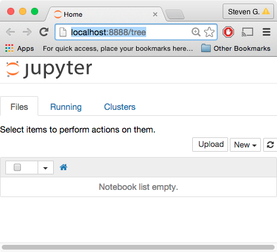
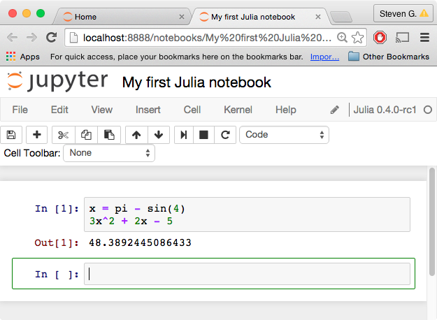
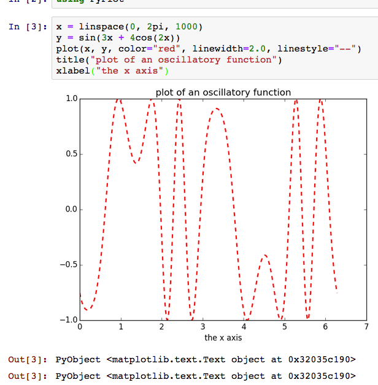

Julia for Numerical Computation in MIT Courses
==============================================

Several MIT courses involving numerical computation, including
[18.06](http://web.mit.edu/18.06/www/),
[18.303](http://math.mit.edu/~stevenj/18.303/),
[18.330](http://homerreid.com/teaching/18.330/),
[18.335/6.337](http://math.mit.edu/~stevenj/18.335/),
[18.337/6.338](http://beowulf.csail.mit.edu/18.337/index.html),
and
[18.338](http://web.mit.edu/18.338/www/),
are
beginning to use [Julia](http://julialang.org/), a fairly new language
for technical computing.  This page is intended to supplement the
[Julia documentation](http://docs.julialang.org/en/latest/) with some
simple tutorials on installing and using Julia targeted at MIT
students.  See also our [Julia
cheatsheet](http://math.mit.edu/~stevenj/Julia-cheatsheet.pdf) listing
a few basic commands, as well as the [Learn Julia in Y minutes](http://learnxinyminutes.com/docs/julia/) tutorial page.

In particular, we will be using Julia in the
[IJulia](https://github.com/JuliaLang/IJulia.jl) browser-based
enviroment, which leverages your web browser and
[IPython](http://ipython.org/) to provide a rich environment
combining code, graphics, formatted text, and even equations, with
sophisticated plots via [Matplotlib](http://matplotlib.org/).

See also Viral Shah's [Julia slides](https://github.com/ViralBShah/julia-presentations/raw/master/Fifth-Elephant-2013/Fifth-Elephant-2013.pdf) and the January 2013 [Julia Tutorial videos](http://julialang.org/blog/2013/03/julia-tutorial-MIT/).

## Why Julia?

Traditionally, these sorts of courses at MIT have used
[Matlab](https://en.wikipedia.org/wiki/MATLAB), a high-level
environment for numerical computation.  Other possibilities might be
[Scientific Python](http://www.scipy.org/) (the [Python
language](http://python.org/) plus numerical libraries), [GNU
R](http://www.r-project.org/), and many others.  Julia is another
high-level free/open-source language for numerical computing in the
same spirit, with a rich set of built-in types and libraries for
working with linear algebra and other types of computations, with a
syntax that is superficially reminiscent of Matlab's.

High-level dynamic programming languages (as opposed to low-level
languages like C or static languages like Java) are essential for
interactive exploration of computational science.  They allow you to
play with matrices, computations on large datasets, plots, and so on
without having to worry about managing memory, declaring types, or
other minutiae—you can open up a window and start typing commands to
immediately get results.

The traditional problem with high-level dynamic languages, however, is
that they are slow: as soon as you run into a problem that cannot
easily be expressed in terms of built-in library functions operating
on large blocks of data ("vectorized" code), you find that your code
is suddenly orders of magnitude slower that equivalent code in a
low-level language.  The typical solution has been to switch to
another language (e.g. C or Fortran) to write key computational
kernels, calling these from the high-level language (e.g. Matlab or
Python) as needed, but this is vastly more difficult than writing code
purely in a high-level language and imposes a steep barrier on anyone
hoping to transition from casual experimentation to "serious"
numerical computation.  Julia mostly eliminates this issue, because it
is carefully designed to exploit a "[just-in-time
compiler](https://en.wikipedia.org/wiki/Just-in-time_compilation)"
called [LLVM](http://llvm.org/), making it possible to write
high-level code in Julia that achieves near-C speed.  (It also means
that we can perform meaningful performance experiments easily in
courses where this matters, e.g.  in 18.335.)

Speed, while avoiding the "two-language" problem of requiring C or
Fortran for critical code, is the initial draw of Julia, but there are
a few other nice points.  Unlike Matlab, it is free/open-source
software, which eliminates licensing headaches and allows you to look
inside the Julia implementation to see how it works (since Julia is
mostly written in Julia, its code is much more readable than a
language like Python that is largely implemented in low-level C).  For
calling existing code, it has easy facilities to [call external C or
Fortran
libraries](http://docs.julialang.org/en/latest/manual/calling-c-and-fortran-code/)
or to [call Python libraries](https://github.com/stevengj/PyCall.jl).
[Multiple
dispatch](http://docs.julialang.org/en/latest/manual/methods/) makes
it especially easy to overload operations and functions for new types
(e.g. to add new vector or numeric types).  Julia's built-in
[metaprogramming](http://docs.julialang.org/en/latest/manual/metaprogramming/)
facilities make it easy to write code that generates other code,
essentially allowing you to extend the language as needed.  And so on...

## Installing Julia and IJulia

Second, [download the current release of Julia](http://julialang.org/downloads/) *version
0.3 or later* and run the installer.
Then run the Julia application (double-click on
it); a window with a `julia>` prompt will appear.  At the prompt,
type:

```jl
ENV["PYTHON"]=""
ENV["JUPYTER"]=""
Pkg.add("IJulia")
Pkg.add("PyPlot")
```

The first two lines set the `PYTHON` and `JUPYTER` environment
variables to nothing, so that Julia will install its own little Python
distribution via
[Miniconda](http://conda.pydata.org/docs/install/quick.html) and the
[Conda.jl](https://github.com/Luthaf/Conda.jl) package.  This is the
most painless way to get a working IJulia
([Jupyter](http://jupyter.org/) browser-based "notebook" interface)
and PyPlot ([Matplotlib](http://matplotlib.org/) Python-based
plotting).  Alternatively, if you really know what you are doing, you
an use your own Python installation (we recommend the
[Anaconda](https://www.continuum.io/why-anaconda) Python
distribution); if you omit those two `ENV` lines it will use whatever
you have installed (assuming it is in your `PATH`).  You can also
switch Python distributions at any time by setting `ENV["PYTHON"]` to
the desired `python` program path and then running
`Pkg.build("PyCall")`.

Then you can launch the notebook by running
```jl
using IJulia
notebook()
```
at the `julia>` prompt, as described below.

### Troubleshooting:

* If you ran into a problem with the above steps, after fixing the
problem you can type `Pkg.build()` to try to rerun the install scripts.
* If you tried it a while ago, try running `Pkg.update()` and try again:
  this will fetch the latest versions of the Julia packages in case
  the problem you saw was fixed.  Run `Pkg.build("IJulia")` if your Julia version may have changed.  If this doesn't work, try just deleting the whole `.julia` directory in your home directory (on Windows, it is called `AppData\Roaming\julia\packages` in your home directory) and re-adding the packages.
* On MacOS, you currently need MacOS 10.7 or later; [MacOS 10.6 doesn't work](https://github.com/JuliaLang/julia/issues/4215) (unless you compile Julia yourself, from source code).
* On Windows, if you get an error `no module named site` when `using PyPlot`, probably you forgot to check the boxes in the Anaconda installer (above) to register Anaconda as the default Python version.  Either reinstall Anaconda or set the [environment variables](http://www.computerhope.com/issues/ch000549.htm) `PYTHONHOME=C:\Anaconda` and `PYTHONPATH=C:\Anaconda\Lib`.
* If the browser opens the notebook and `1+1` works but basic functions like `sin(3)` don't work, then probably you are running Python and not Julia.  Look in the upper-left corner of the notebook window: if it says **IP[y]: Notebook** then you are running Python.  Probably this was because your `Pkg.add("IJulia")` failed and you ignored the error.
* Internet Explorer 8 (the default in Windows 7) or 9 don't work with the notebook; use Firefox (6 or later) or Chrome (13 or later).  Internet Explorer 10 in Windows 8 works (albeit with a few rendering glitches), but Chrome or Firefox is better.
* If the notebook opens up, but doesn't respond (the input label is `In[*]` indefinitely), try running `ipython notebook` (without Julia) to see if `1+1` works in Python.  If it is the same problem, then probably you have a [firewall running](https://github.com/ipython/ipython/issues/2499) on your machine (this is common on Windows) and you need to disable the firewall or at least to allow the IP address 127.0.0.1.  (For the [Sophos](https://en.wikipedia.org/wiki/Sophos) endpoint security software, go to "Configure Anti-Virus and HIPS", select "Authorization" and then "Websites", and add 127.0.0.1 to "Authorized websites"; finally, restart your computer.)
* If the notebook opens up but shows the Jupyter logo, you are running a beta version of IPython Notebook (3.0.0b1) that is not currently supported. Check by running `ipython --version` in the command line that you are running version 2.x (currently 2.3.1).
* On Windows, if the notebook says the kernel crashed (repeatedly) and there is an error message `"julia-readline.exe" is not recognized` in the command-line window, the problem is that you aren't running the `ipython` command from within the Julia `bin` directory; see the "Important" note below.
* Enthought Canopy/EPD will not work; it is currently [incompatible with PyCall](https://github.com/stevengj/PyCall.jl/issues/42).   See [this page on uninstalling Canopy](https://support.enthought.com/entries/23580651-Uninstalling-Canopy); on MacOS and GNU/Linux, it is sufficient to delete any Canopy-related lines from the `.profile` and `.bash_profile` files in your home directory.

### Julia on MIT Athena

Julia is also installed on MIT's [Athena Computing
Environment](http://ist.mit.edu/athena).  Any MIT student can use the
computers in the [Athena Clusters](http://ist.mit.edu/athena-clusters)
on campus, and you can also log in remotely to `athena.dialup.mit.edu`
via [ssh](https://en.wikipedia.org/wiki/Secure_Shell).  (*Note*: the
`linux.mit.edu` dialup does *not* work with Julia.)

In the terminal of an Athena machine, type:
```
add julia
```
to load the Julia and IPython software locker.

The *first* time you use Julia on Athena, you will need to set up IJulia: run `julia`, and at the `julia>` prompt, type
```jl
Pkg.update()
ENV["JUPYTER"]=""
Pkg.add("PyPlot")
Pkg.add("IJulia")
```

Thereafter, you can run the notebook as below.

(Unfortunately, as of this writing Athena still has IPython version 2,
whereas IJulia requires IPython version 3 or later, so you can't use
the `ipython` on Athena.)

#### Remote access to Julia on Athena.

If you are [logging in
remotely](http://kb.mit.edu/confluence/pages/viewpage.action?pageId=3907166)
to `athena.dialup.mit.edu`, you can use a trick called "port
forwarding" to run IJulia in your local web browser (MUCH faster and
nicer than running a web browser remotely over X Windows).   The steps are:

* Log in by typing `ssh -L 8778:localhost:8998 athena.dialup.mit.edu` into your terminal.  (This works with Macs and GNU/Linux; how you do it on Windows will depend upon your ssh client and whether it supports port forwarding: you want to forward port 8998 on the remote machine to port 8778 on `localhost`.)

* `add julia` and make sure IJulia is installed as above.

* Quit Julia and type (at the Athena prompt): `ipython notebook --no-browser`  ... unfortunately, this won't work until Athena installs a newer version of `ipython`.  Instead of `ipython`, you can find the `jupyter notebook` command that Julia installs by running `using IJulia; join(IJulia.notebook_cmd, " ")` in Julia.

* In your ordinary web browser, type `localhost:8778` in the address bar.

You should see the IPython dashboard for IJulia running on Athena (creating a new notebook will create the file in your Athena account).

### Updating Julia and IJulia

Julia is improving rapidly, so it won't be long before you want to
update to a more recent version.  The same is true of Julia add-on
packages like PyPlot.  To update the packages only, keeping Julia itself
the same, just run:
```jl
Pkg.update()
```
at the Julia prompt (or in IJulia).

If you download and install a new version of Julia from the Julia web
site, you will also probably want to update the packages with
`Pkg.update()` (in case newer versions of the packages are required
for the most recent Julia).  In any case, if you install a new Julia
binary (or do anything that changes the location of Julia on your
computer), you *must* update the IJulia installation (to tell IPython
where to find the new Julia) by running `Pkg.build("IJulia")` at the
Julia command line (not in IJulia).

## Running Julia in the IJulia Notebook

Once you have followed the installation steps above, open up the
Julia command line (run `julia` or double-click the `julia` program)
and run
```jl
using IJulia
notebook()
```
(You will have to leave the Julia command-line window open in order
to keep the IJulia/Jupyter process running.  Alternatively, you can run `notebook(detached=true)` if you want to run the Jupyter server as a background process, at which point you can close the Julia command line, but then if you
ever want to restart the Jupyter server you will need to kill it manually.

A "dashboard" window like this should open in your web browser (at address `localhost:8888`, which you can return to at any time as long as the `notebook()` server is running; I usually keep it running all the time):



Now, click on the *New* button and select the *Julia* option to start a new "notebook".  A notebook will combine code, computed results, formatted text, and
images; for example, you might use one notebook for each problem set.
The notebook window that opens will look something like:


You can click the "Untitled" at the top to change the name, e.g. to
"My first Julia notebook".  You can enter Julia code at the `In[ ]`
prompt, and hit **shift-return** to execute it and see the results.
If you hit **return** *without* the shift key, it will add additional
lines to a single input cell.  For example, we can [define a variable](http://docs.julialang.org/en/latest/manual/variables/)
`x` (using the built-in constant `pi` and the built-in function
`sin`), and then evaluate a polynomial `3x^2 + 2x - 5` in terms of `x`
(note that, unlike Matlab or Python, we don't have to type `3*x^2` if
we don't want to: a number followed by a variable is automatically
interpreted as multiplication without having to type `*`):



The result that is printed (in `Out[1]`) is the *last* expression from
the input cell, i.e. the polynomial.  If you want to see the value of
`x`, for example, you could simply type `x` at the second `In[ ]` prompt
and hit shift-return.

See, for example, the [mathematical operations in the Julia
manual](http://docs.julialang.org/en/latest/manual/mathematical-operations/)
for many more basic math functions.

## Plotting

There are several plotting packages available for Julia.  If you
followed the installation instructions, above, you already have one
full-featured Matlab-like plotting package installed:
[PyPlot](https://github.com/stevengj/PyPlot.jl), which is simply a
wrapper around Python's amazing [Matplotlib](http://matplotlib.org/) library.

To start using PyPlot to make plots in Julia, first type `using
PyPlot` at an input prompt and hit shift-enter.  `using` is the Julia
command to load an [external
module](http://docs.julialang.org/en/latest/manual/modules/) (which
must usually [be
installed](http://docs.julialang.org/en/latest/manual/packages/)
first, e.g. by the `Pkg.add("PyPlot")` command from the installation
instructions above).  The *very first* time you do this, it will
take some time; in Julia 0.4 or later, the module and its dependencies will be
"precompiled" so that in subsequent Julia sessions it will load quickly.

Then, you can type any of the [commands from
Matplotlib](http://matplotlib.org/api/pyplot_api.html), which includes
equivalents for most of the Matlab plotting functions.  For example:



## Printing/exporting Notebooks

Currently, printing a notebook from the browser's *Print* command <a
href="https://github.com/ipython/ipython/issues/4196">can be somewhat problematic</a>.  There are four solutions:

* At the top of the notebook, click on the *File* menu (in the
  notebook, *not* the browser's global menu bar), and choose **Print
  Preview**.  This should open up a window/tab that you can print
  normally.

* For turning in homework, a class may allow you to submit the notebook file
  (`.ipynb` file) electronically (the graders will handle printing).  You can save a notebook file in a different location by choosing **Download as** from the notebook's *File* menu.

* The highest-quality printed output is produced by IPython's
  [nbconvert](http://ipython.org/ipython-doc/rel-1.0.0/interactive/nbconvert.html)
  utility.  For example, if you have a file `mynotebook.ipynb`, you
  can run `ipython nbconvert mynotebook.ipynb` to convert it to an
  HTML file that you can open and print in your web browser.  This
  requires you to install [IPython](http://ipython.org/install.html),
  [Sphinx](http://sphinx-doc.org/latest/install.html) (which is
  automatically installed with the Anaconda Python/IPython distribution), and
  [Pandoc](http://johnmacfarlane.net/pandoc/installing.html) on your
  computer.

* If you post your notebook in a Dropbox account or in some other
  web-accessible location, you can paste the URL into the online [nbviewer](http://nbviewer.ipython.org/) to get a printable version.
